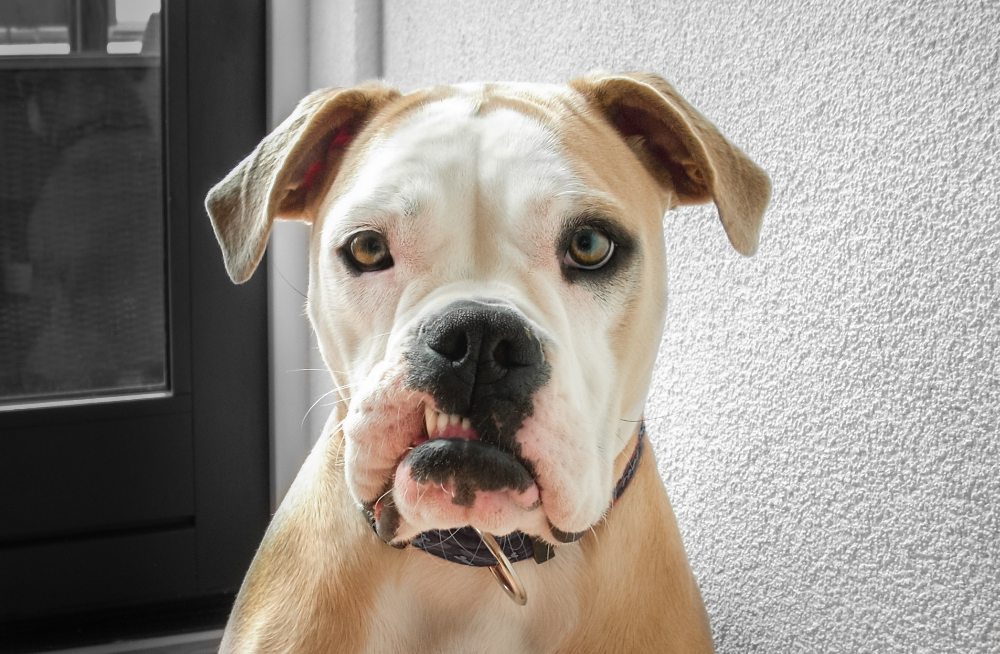
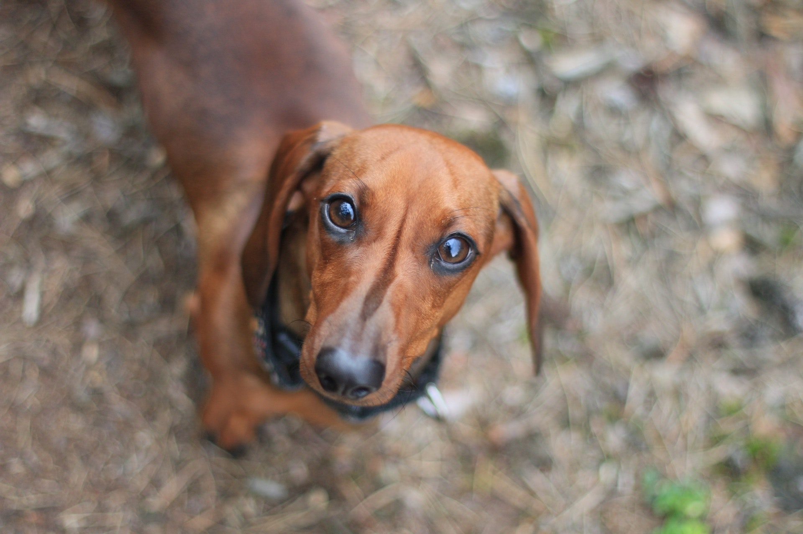
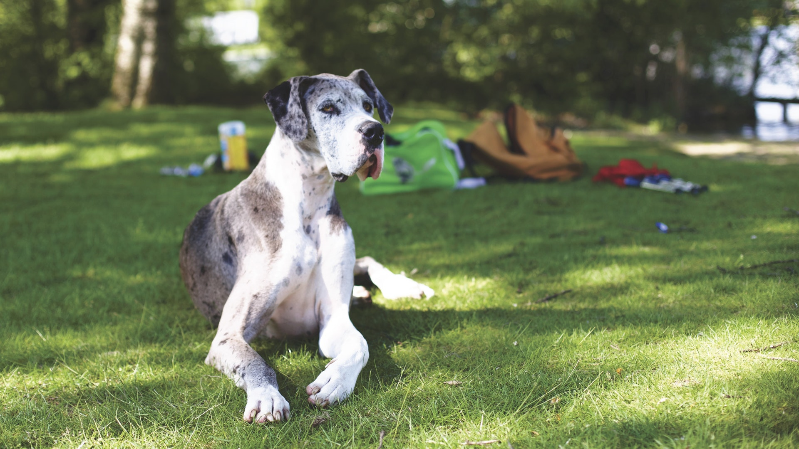
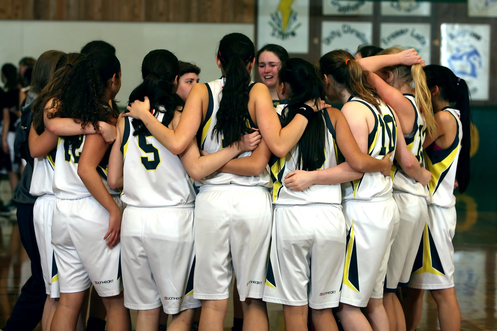
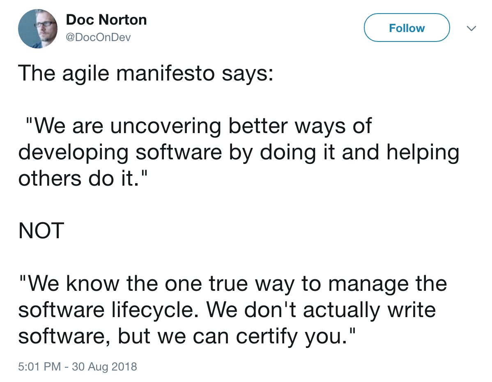
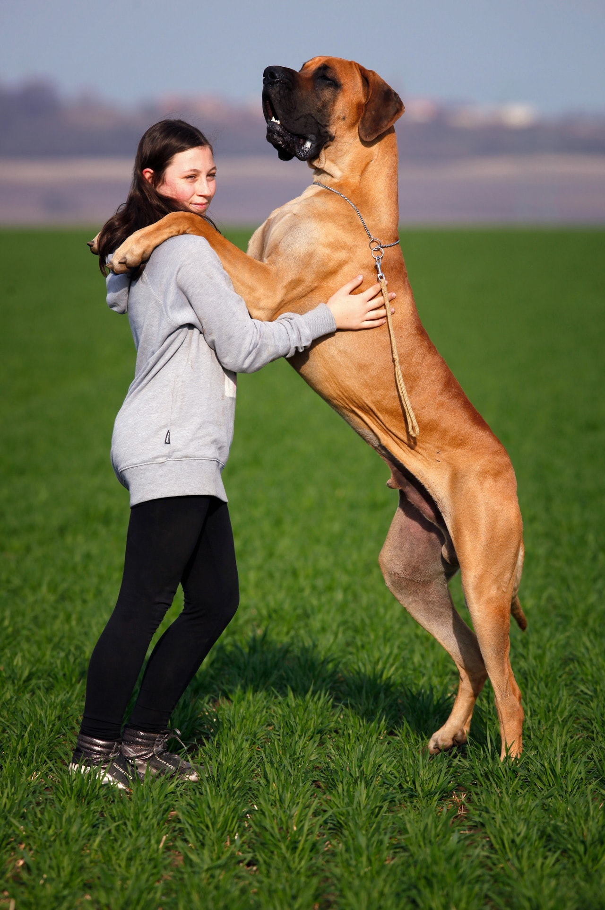
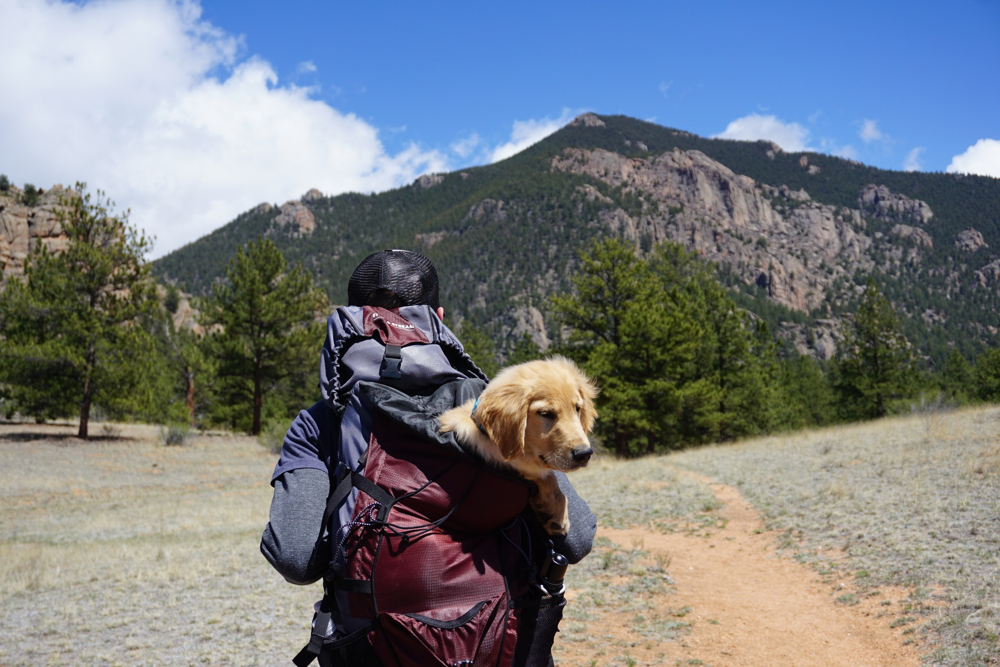
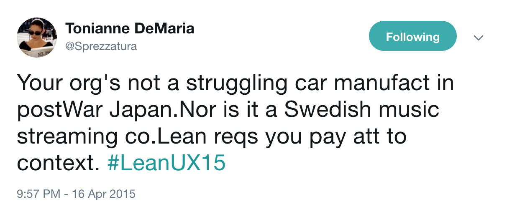

theme: Sketchnote, 5

^ Hopefully, you've been looking at this handsome pupper as you got seated. For those who don't know, this is a Bulldog. An American Bulldog to be precise. They tend to be small, but muscular, with droopy jowls.
^ They also tend to suffer from respiratory issues. They have small nostrils, and a long face, making it hard for them to breath, especially when overheated.

---

^ This, meanwhile, is a dachshund. Sometimes called a sausage dog. Their long bodies with weirdly short legs were bred for a reason: to chase burrow dwelling animals out of their holes. The name "dachshund" translates directly as "Badger Dog."
^ Note the mini-dachshund was not bred to find mini badgers. It was rabbits.
^ The long bodies mean they are at higher risks for back issues, especially if they are overweight.

---

^ Right about now some of you are wondering if this talk is all dogs. It is. Let's list and rate ALL OF THE DOGS.

---

^ On the other end of the spectrum from the sausage dog, we have the Great Dane. As a breed, they tend to be exceptionally friendly, very nervous of other dogs (hence the Scooby Doo stereotype), and absolutely massive.
^ The problem with big dogs like this are, sadly, manifold. From joint issues to weak hearts, they have a lifespan of 8-10 years.

---

# Breeds

^ It's important to realise that dogs are all the same species; as distinct to say, birds.
^ Most breeds are relatively modern, with breed standards starting only 100-150 years ago. Newer breeds can be a few decades old.
^ We basically picked dogs who showed characteristics we wanted to see more of and mated them. Working dogs with purposes. Aesthetic diversity. But a growing sickness: we favoured short-term outcomes and feeling good over systemic health.

---

# Beyond Frameworks
## Thinking and Tools

@garyfleming

^ Anyway, that's enough about dogs and breeding. On to something that is entirely unrelated.
^ Who I am.
^ I'm here to talk about agile and its current breeds... Did I say breeds? I meant frameworks. This isn't about dogs.

---

# Chapter XXXX: Forgotten Value

^ We should be focussing on the things we value, not the means by which we do them.
^ A while back I was getting fed-up seeing rote forms of agile. People doing the scrum they learned from someone else. People following a process with which they had absolutely no engagement. Meme-copying. Cargo culting. They'd forgotten the value. They'd forgotten to think.

---

# What in "agile" do we find valuable?

* Retros
* Self-organisation
* Collaboration

^ Some of the things I find most valuable in the agile world, in no particular order.

---

# People. It's a team sport.

^ It's about people. Working together. Well.
^^^ The work we're doing is a team sport.
^ The idea of the lone developer being a firefighting hero is over. It was never desirable in the first place.
^ The idea that managers had to "sweat the resources" is over. It was never desirable in the first place.
^ The things above help us work together; with care, kindness, and reflection. -->

---

^ It's not like Agile itself prevents this.
^^ Manifesto: that Doc Norton Tweet. https://twitter.com/DocOnDev/status/1035195859456147456

---

| x | y|
| --- | ---: |
| Individuals and Interactions | Processes and Tools |
| Working Software | Comprehensive Documentation |
| Customer Collaboration | Contract Negotiation |
| Responding to Change | Following a Plan|

^^ We can see that in the Manifesto values: Look carefully. What do you see.

---

| Collaboration | Constraint |
| --- | ---: |
| Individuals and Interactions | Processes and Tools |
| Working Software | Comprehensive Documentation |
| Customer Collaboration | Contract Negotiation |
| Responding to Change | Following a Plan |

^^ The left hand side are notions of working together collaboratively without structure, the right hand size is management/structure/control.

---

^ So lets's talk about that: let's talk about how we put the Agile back in our process and figure out other ways to get what we value

---

# Chapter XXXX: Standing up

^ If agile teams have a common practice that is near universal, it's the morning standup. Sadly, it's also the place where I first see dysfunction amongst most teams.

---

# Usually Bad. Why? #

^ Last week, when I was starting to write this, no fewer than 3 people, unprompted, told me they hate their standups, so I think I'm barking up the right tree.
^ They're not engaging. Often just using the three questions (What did you do yesterday...?) to tick boxes and do traditional waterfall project management. No engagement, no purpose, no joy.

---

# Death Spiral of Justification

^ People go on far too long in order to justify their existence. People don't come to work to not do anything, so why make them justify what they did every day? Why make people listen to a list of tasks someone else did yesterday? I promise you that I don't care. It's not news. Just like the "Queen isn't dead".

---

# The Long Wait

^ People also often leave all issues until the standup. This is infuriating. If someone else in the team can help, don't wait! Go ask. We might all have pieces of the work, but we all must have the same goal. No-one wins unless we all do.

---

# Make Standing Up Burden-Free #

^ How might we improve?
^ Focus on the work. Walk the board. Start on the far right (most done) column, and move left so that we focus on getting things finished.
^ If people don't speak on a given day, that's fine. Make it clear we just want status and any issues. Don't need a comprehensive walkthrough of what you did.
^ Take a minute to think about the sprint goal. Are we still headed towards it? If not, why not? It's okay to not be, but understand why and what could be done. That's what this ceremony is supposed to be for: alignment to and progress towards the sprint goal.

---

# Chapter XXXX: Every Time You Draw 🎨 a Sailboat ⛵️, A Fairy 🧚‍♀️ Dies 💀

^ I want to start by saying I don't hate the sailboat retro and I don't think you're a bad person for using it. I use it a bunch, particularly when I start working with teams, or I'm running a retro for a team I don't know.

---

# Goals of a Retrospectives - George Dinwiddie

* Definition: "...looking at the past to guide choices for the future."
* Goal 1: "Joint Learning"
* Goal 2: "... make a decision, or choose an action"
* Goal 3: "... strengthening the common bond"

^ To understand the chapter title, let's first think about why we retrospect.
^ Briefly explain each. Seems fair, and reasonable to me.

---

# Generic Retros

^ retrospective formats. A handful of standards, all probing the same thing. Stop, start, continue. Lacked, liked, lalala. Million better ways to go.
^ The problem with standard retros is they eventually dissolve engagement. People see a rote idea and act accordingly.
^ TODO Add more here

---

^ Lots of avenues to explore. Think about what people have been grumbling about during the week and do a retro on that.
^ Pick a topic and focus: mobbing, planning, code reviews, whatever.
^ Maybe you want to focus on team harmony - Focus a retro around where people are and aren't working well together.
^ Ask "What would the other teams we work with say about us? How do we change that?"

---

# Retros are Not Continuous Improvement

^ While we're on retros, let's realise that they aren't continuous improvement. They tend to be slow and on a cadence, a topic I want to delve into deeper very soon.
^ TODO bulk out

---

# Retrospect Sooner

* Immediate Pain,
* 3 Items,
* Two Weeks.

^ You can still do retros on cadence if you want. I'd see inspecting and adapting on cadence as a minimum threshold. But when you have problems INSPECT AND ADAPT NOW
^ Put up a board and adopt the rule: immediate action, 3 items, or two weeks

---

# Chapter XXXX: The New Years Resolution

^ TODO Cadence

---

# Chapter XXXX: You are not a Postwar Swedish Car Stream, and other mistakes

^ TODO Models, spotify

---

---

# Chapter XXXX: Continuous Delivery is Your Future

^ TODO Ci/CD,

---

# Chapter XXXX: I Am Wrong, And So Might You Be

^ TODO include structurelessness

---

# Ending: Be More Mutt

^ TODO conclusion. Bring back to dog breeds. Appreciate the breeds. Appreciate that we need to be careful. Be more willing to accept mutts if they're right for us.

---

# Thank You

@garyfleming
