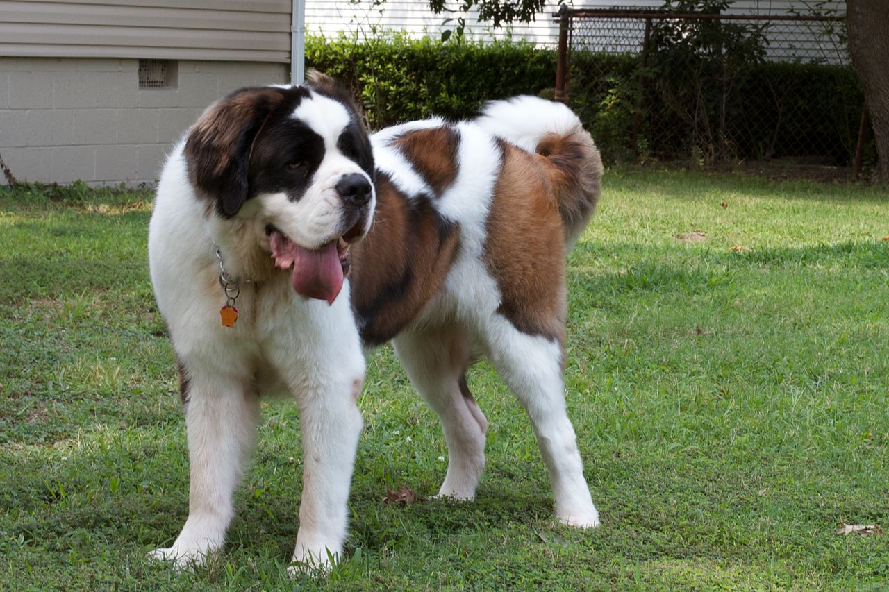
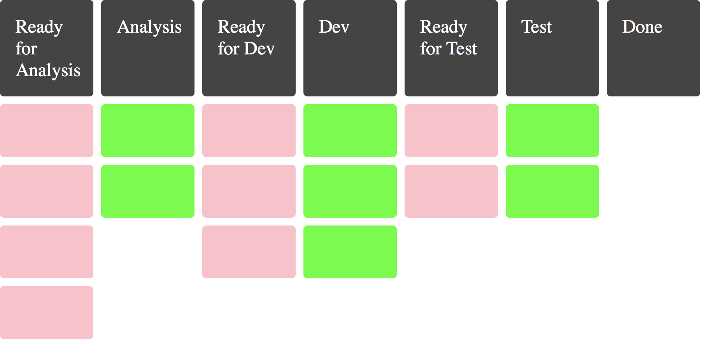
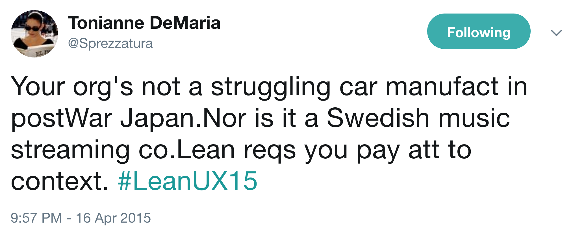

theme: Next, 4

^ Hopefully, you've been looking at this handsome pupper as you got seated. For those who don't know, this is a Bulldog. An American Bulldog to be precise. They tend to be small, but muscular, with droopy jowls.
^ They also tend to suffer from respiratory issues. They have small nostrils, and a long face, making it hard for them to breath, especially when overheated.

---

^ This, meanwhile, is a dachshund. Sometimes called a sausage dog. Their long bodies with weirdly short legs were bred for a reason: to chase burrow dwelling animals out of their holes. The name "dachshund" translates directly as "Badger Dog."
^ Note the mini-dachshund was not bred to find mini badgers. It was rabbits.
^ The long bodies mean they are at higher risks for back issues, especially if they are overweight.

---

^ Right about now some of you are wondering if this talk is all dogs. It is. Let's list and rate ALL OF THE DOGS.

---

^ On the other end of the spectrum from the sausage dog, we have the Great Dane. As a breed, they tend to be exceptionally friendly, very nervous of other dogs (hence the Scooby Doo stereotype), and absolutely massive.
^ The problem with big dogs like this are, sadly, manifold. From joint issues to weak hearts, they have a lifespan of 8-10 years.

---

# Breeds vs. Species

^ It's important to realise that dogs are all the same species; as distinct to say, birds.
^ Most breeds are relatively modern, with breed standards starting only 100-150 years ago. Newer breeds can be a few decades old.
^ We basically picked dogs who showed characteristics we wanted to see more of and mated them. Started with working dogs with purposes. Aesthetic diversity.

---

# A Sickness

^ But a growing sickness: we favoured short-term outcomes and feeling good over systemic health.

---

# Beyond Frameworks
## Thinking and Tools

@garyfleming

^ Anyway, that's enough about dogs and breeding. On to something that is entirely unrelated.
^ Who I am.
^ I'm here to talk about agile and its current breeds... Did I say breeds? I meant frameworks.

---

^ So, someone way smarter than me said this, and I agree. I want to be clear that I'm not trying to bad mouth existing methods. I want focus on finding more value in them, or seeking alternatives where appropriate, while accepting the existing methods were contextually useful at some point in time.

---

  

^ I'm going to start with a little bit of a general constraint, then talk about some small practical ideas, and move on to bigger ideas that might be a bit more... slobbery

---

# Chapter 1: Forgotten Value

^ We should be focussing on the things we value, not the means by which we do them.
^ A while back I was getting fed-up seeing rote forms of agile. People doing the scrum they learned from someone else. People following a process with which they had absolutely no engagement. Meme-copying. Cargo culting. They'd forgotten the value. They'd forgotten to think.

---

# What in "agile" do we find valuable?

* Retros
* Self-organisation
* Collaboration

^ Some of the things I find most valuable in the agile world, in no particular order.

---

# It's a team sport.

^ It's about people. Working together. Well.
^^^ The work we're doing is a team sport.
^ The idea of the lone developer being a firefighting hero is over. It was never desirable in the first place.
^ The idea that managers had to "sweat the resources" is over. It was never desirable in the first place.
^ The things above help us work together; with care, kindness, and reflection.

---

^ It's not like Agile itself prevents this.
^^ Manifesto: that Doc Norton Tweet. https://twitter.com/DocOnDev/status/1035195859456147456

---

| x | y|
| --- | ---: |
| Individuals and Interactions | Processes and Tools |
| Working Software | Comprehensive Documentation |
| Customer Collaboration | Contract Negotiation |
| Responding to Change | Following a Plan|

^^ We can see that in the Manifesto values: Look carefully. What do you see.

---

| Collaboration | Governance |
| --- | ---: |
| Individuals and Interactions | Processes and Tools |
| Working Software | Comprehensive Documentation |
| Customer Collaboration | Contract Negotiation |
| Responding to Change | Following a Plan |

^^ The left hand side are notions of working together collaboratively without structure, the right hand size is structure/control/governance.

---

^ So lets's talk about that: let's talk about how we put the Agile back in our process and figure out other ways to get what we value

---

# Chapter 2: Standing up

^ If agile teams have a common practice that is near universal, it's the morning standup. Sadly, it's also the place where I first see dysfunction amongst most teams.

---

# Usually Bad. Why?

^ When I first wrote this, no fewer than 3 people, unprompted, told me they hate their standups, so I think I'm barking up the right tree.
^ They're not engaging. Often just using the three questions (What did you do yesterday...?) to tick boxes and do traditional waterfall project management. No engagement, no purpose, no joy.

---

# Death Spiral of Justification

^ People go on far too long in order to justify their existence. People don't come to work to not do anything, so why make them justify what they did every day? Why make people listen to a list of tasks someone else did yesterday? I promise you that I don't care. It's not news. Just like the "Queen isn't dead".

---

# The Long Wait

^ People also often leave all issues until the standup. This is infuriating. If someone else in the team can help, don't wait! Go ask. We might all have pieces of the work, but we all must have the same goal. No-one wins unless we all do.

---

# Make Standing Up Burden-Free #

^ How might we improve?
^ Focus on the work. Walk the board. Start on the far right (most done) column, and move left so that we focus on getting things finished.
^ If people don't speak on a given day, that's fine. Make it clear we just want any issues or requests for help. Don't need a comprehensive walkthrough of what you did.

---

# Sprint Goals

^ Take a minute to think about the sprint goal. Are we still headed towards it? If not, why not? It's okay to not be, but understand why and what could be done. That's what this ceremony is supposed to be for: alignment to and progress towards the sprint goal.

---

# Stand-ups are part of team play

^ If you use stand-ups, remember that they're how your team gets together to make sure they'll get the joint goals achieved. Make sure we're all getting that value.

---

# Chapter 3: Every Time You Draw 🎨 a Sailboat ⛵️, A Fairy 🧚‍♀️ Dies 💀

^ I want to start by saying I don't hate the sailboat retro and I don't think you're a bad person for using it. I use it a bunch, particularly when I start working with teams, or I'm running a retro for a team I don't know.

---

# Goals of a Retrospectives - George Dinwiddie

* Definition: "...looking at the past to guide choices for the future."
* Goal 1: "Joint Learning"
* Goal 2: "... make a decision, or choose an action"
* Goal 3: "... strengthening the common bond"

^ To understand the chapter title, let's first think about why we retrospect.
^ Briefly explain each. Seems fair, and reasonable to me.

---

# Generic Retros

## 🐶🐶🐶🐶🐶🐶🐶🐶🐶🐶🐶
## 🐶🐶🐶🐶🐶🐶🐶🐶🐶🐶🐶
## 🐶🐶🐶🐶🐶🐶🐶🐶🐶🐶🐶
## 🐶🐶🐶🐶🐶🐶🐶🐶🐶🐶🐶

^ retrospective formats. A handful of standards, all probing the same thing. Stop, start, continue. Lacked, liked, lalala. Million better ways to go.
^ The problem with standard retros is they eventually dissolve engagement. People see a rote idea and act accordingly.
^ They want to enjoy

---

# Retro Exploration

^ Lots of avenues to explore. Think about what people have been grumbling about during the week and do a retro on that.
^ Deep dive a previous grumble. Pick a topic and focus: mobbing, planning, code reviews, whatever.
^ Maybe you want to focus on team harmony - Focus a retro around where people are and aren't working well together.

---

# Retro Exploration

* "Let's talk about Code Reviews"
* "What would the other teams we work with say about us? How do we change that?"
* "Are we the right-shape for a team?"

---

# Retros are Not Continuous Improvement

^ While we're on retros, let's realise that they aren't continuous improvement. They tend to be slow and on a cadence, a topic I want to delve into deeper very soon.
^ We need to do better.

---

# Retrospect Sooner

* Immediate Pain,
* 3 Items,
* Two Weeks.

^ You can still do retros on cadence if you want. I'd see inspecting and adapting on cadence as a minimum threshold. But when you have problems INSPECT AND ADAPT NOW
^ Put up a board and adopt the rule: immediate action, 3 items, or two weeks

---

# Chapter 4: The New Year's Resolution

---

^ Someone told me once, in late-October, that they were planning to start going to the gym in January. A new year's resolution.
^ We had a chat and it was clear it was something they wanted to do to aid in their goals (overall fitness, losing weight).
^ I asked why wait? Were there things making it difficult to do it now that wouldn't be there in January?
^ They thought about it and realised the answer was no.
^ They had become so fixated on time, the idea of resolutions, they hadn't looked beyond it. Pushing off change to a later date that could deliver greater value NOW.

---

## Cadence is a constraint.
## Cadence is always suboptimal

^ Cadence is the use of time as a supposed enabling constraint
^ Time as a constraint is **always** suboptimal. There is always a better measure. Can be harder to see. Can be harder to track. It's always there.

---

# An Example: Sprints

* Planning
* Delivery
* Customer Feedback
* Show and tells
* Retrospectives

^ Sprints encourage us to do all these things, through various ceremonies, on the same fixed cadence. It might be the case that's optimal for your team. I doubt it.

---

# Forget Sprints: Get Greater Value Now

^ The work we do rarely fits exactly into a sprint. When it seems to, it's usually artificially fitted to the arbitrary time constraint.
^ Rather than waiting weeks, how could you get some value right now? Today? Learn about design sprints, CI/CD, and learning more quickly

---

# Forget Sprints: Customer Collaboration

^ We should speak to, monitor, and engage with our customers and, we should use that as our feedback loop. We should be working with our customers daily to figure out, given what we collectively know, what we should be thinking about right now.
^ NOT what we might start in two weeks time. Or usually multiple sprints away.

---

# Forget Sprints: Just-in-Time Planning

^ Rather than planning on cadence, consider planning just-in-time. There are different ways of doing this, but rather than using time as your mechanism for more planning, use the board. As the "Ready for Analysis" column empties, use it as a signal to have more work ready to add.

---

# Forget Sprints: Respond to Change

^ If we want to respond to change meaningfully, it helps to avoid filling up multiple weeks worth of a schedule. As well as working with out customers, we should be able to handle interruptions when they happen. We should be able to take onboard new learning quickly.
^ TODO EXPAND explain an alternative

---

# Forget Sprints: Continuous Delivery

^ And rather than releasing on cadence, do it ALL THE TIME. Why wait a few weeks to get value when you can start today?

---

^  Want to decide next thing of value, come up with an experiment of how to achieve that, figure out whether it worked. Needs constrained in some way, but "two week sprint every time" is crude. What other constraints could you use? What does the board tell us?

---

# Chapter 5: Postwar Swedish Car Streaming Ritual

---

# Ritualism

^ People have lots of rituals and ceremonies that we cling to. We have the big obvious ones like weddings, and we have the little family rituals like always going to the same restaurant after going to the cinema.

---

^ Ritualism.
^ Humans like ceremonies. They like ritualism. They give us a sense of order and certainty against the howl of an uncaring universe.
^ When we partake in ceremonies and rituals, we are leaving our responsibility at the door. That's a powerful thing. Do the right moves, chant in the right way, and the ceremony will provide an outcome. Sometimes, like a wedding, that outcome is a commitment.
^ TODO is this too rambling/incoherent? Maybe need some examples.

---

# Frameworks Are For Feelings

^ So we turn to Frameworks, like XP or Scrum or myriad others. They make us feel better. They give us a method, any method, so we can make progress and measure ourselves against the yardstick of the framework.

---

^ But often we don't know why. Ask your teams why they stand-up, who is it for, and how much they care. Ask the same about all your ceremonies. Run a retro on retros. If there is trust in the room, you might find they don't really know why they are doing these ceremonies; and it's certainly not for their own benefit. (Aside: how often do you see teams who skip stand-ups when their PO/SM isn't there? TOO MANY)

---

# Spoti-what?

^ This happens beyond the team at the org level too. There are lots of models that people try to copy without consideration. Consider something like the Spotify Model. We're seeing the language of tribes and guilds spread, but without any real understanding of the why.

---

* Spotify Model was originally a sketch of an idea.
* It was partly implemented at Spotify, but not fully or uniformly.
* It was only tried in part of the org.

^ The thing is Spotify didn't particularly use the model. Depending on who you see speak about it, you realise it was never really anything more than a snapshot.
^ So the spotify model wasn't fully used, didn't really exist. At this point, do we know if Spotify itself really exists?

---

# Lessons From Spotify

* The model doesn't really matter.
* The journey is what matters
* Give teams space to think about improvement.

^ The Spotify Model really isn't about the model. It's about a culture from top-to-bottom that supports experimentation and innovation. That's fine with putting new ideas out there and giving them a try.
^ Foster a culture of trying

---

^ I love this quote. It sums up a big part of what I'm getting at: your org are not these other orgs. Stop trying to be them; try to figure out who you are. It's fine to look for inspiration, but copying, less so.

---

# Chapter 6: Reel Missing

## 🎞🎞🎞🎞🎞⛔️🎞

^ Chapter 6 isn't quite where I want it to be yet. Consider it a missing reel.

<!-- ---

# Chapter 6: Continuous Delivery is Your Future

^ TODO Ci/CD,
^ Premise is that CD practices are the current best guess at future of agile. Let's talk about why, the data, the how, feedback loops etc. Link back to the Cat Swetel quote from the start
 -->

---

# Chapter 7: I Am Wrong, And So Might You Be

^ Here's the thing: I'm rabble-rousing. I'm encouraging you to leave behind all the tawdry constraints of the models and ceremonies and do something for yourself.
^ I know I'm wrong.

---

^ Starting from nothing... is kinda hard. It's useful to start from an existing model and evolve it. Heck, Scrum calls it out in the three pillars (visualise, inspect, adapt). We should see the models, frameworks, ceremonies etc as tools in a toolbelt. We should pull them out when appropriate. We should put them back and choose another when we can. We should accept there are tools that don't already exist that we might have to experiment to find.

---

^ Structurelessness can be tyrannical. There's a games company who are well-known to be flat and structureless... but the stories we're now hearing about it suggest that's not the case. In the presence of no formal structures, informal structures crept in. That meant factionalism, cronyism, bullying. It's much harder to fix problems in informal structures, especially when no formal structures exist to enact them.

---

# Anarchy vs Autonomy

## Autonomy is enabled by alignment and competence

^ Marquet argues that autonomy is enabled by alignmnet and competence. We're not looking for a rule free world. Or everyone doing their own thing. While that might be possible, it's not particularly tractable; hard to get from here to there.

---

# Seek the Right Constraints.

^ Find Constraints that make sense for you, particularly when we're working in complexity. These are governing and enabling constraints. Look beyond the ones that come in the box with the model. Look beyond time.

---

# I'm Wrong, And So Might You Be.

^ I Know I'm wrong. So might you be.

---

# Be Unique. Be You.

^ Bring back to dog breeds. Appreciate the breeds. Appreciate that we need to be careful. Be more willing to accept mutts if they're right for us.

---

# Thank You

@garyfleming
