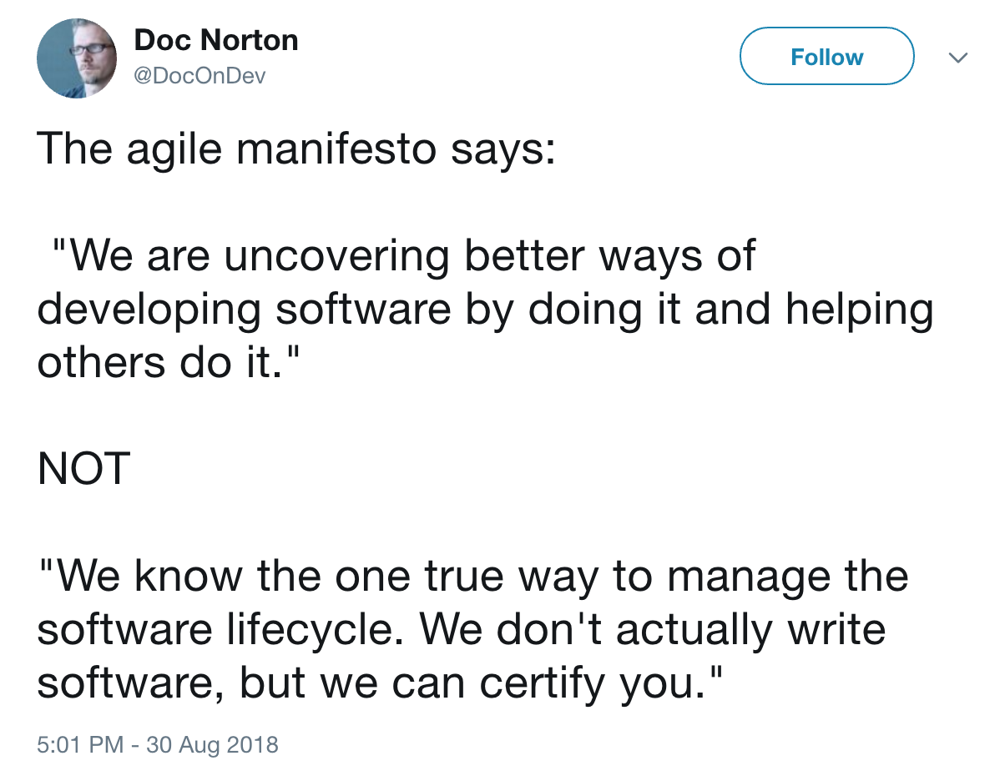

theme: Poster, 7

# Kicking Away the Crutches of Agile

@garyfleming

^ Who I am.

---

# v0.0.1 - Super Early Beta Draft

^ Super early beta draft
^^ Much shorter, fewer ideas explored, and less well
^^ More ranty, less balanced/considered
^^ No jokes, few cat pictures,

---

^ 5...4...3...

---

# Crutches: A Metaphor

^ What do I mean by kicking away the crutches of agile?
^^ Metaphor. I do not condone kicking away actual crutches. Nor am I implying that, in the real world, away from the metaphor, that people don't need walking aids or are in any way **lesser** for using them

---

# Hurt

^ What does it mean?
^ Imagine someone at the top of a cliff, a waterfall. They slip, fall, and hurt themselves.
^ They might, for a while, need something to help them continue walking. That's okay, but it's probably a crutch.
^ It's better than hurting, but we need to recognise when it's hindering.

---

# 🚶‍♀️🚶🏾‍♂️🏃🏼‍♀️🏃🏿‍♂️🕺💃🏽

^^ When we should be doing more physio, to be a bit more agile.
^^ so that we can walk, and run, and dance... Whatever we need to do at any given time.
^ Just because something helped us in the past, doesn't mean it isn't constraining us now.

---

# Forgotten Value

^ We should be focussing on the things we value, not the means by which we do them.
^ A while back I was getting fed-up seeing rote forms of agile. People doing the scrum they learned from someone else. People following a process with which they had absolutely no engagement. Meme-copying. Cargo culting. They'd forgotten the value. They'd forgotten to think.

---

# What in "agile" do we find valuable?

* Retros
* Self-organisation
* Collaboration

^ Some of the things I find most valuable in the agile world, in no particular order.

---

# People. It's a team sport.

^ It's about people. Working together. Well.
^^^ The work we're doing is a team sport.
^ The idea of the lone developer being a firefighting hero is over. It was never desirable in the first place.
^ The idea that managers had to "sweat the resources" is over. It was never desirable in the first place.
^ The things above help us work together; with care, kindness, and reflection.

---

^ It's not like Agile itself prevents this.
^^ Manifesto: that Doc Norton Tweet. https://twitter.com/DocOnDev/status/1035195859456147456

---

| x | y|
| --- | ---: |
| Individuals and Interactions | Processes and Tools |
| Working Software | Comprehensive Documentation |
| Customer Collaboration | Contract Negotiation |
| Responding to Change | Following a Plan|

^^ We can see that in the Manifesto values: Look carefully. What do you see.

---

| Collaboration | Management |
| --- | ---: |
| Individuals and Interactions | Processes and Tools |
| Working Software | Comprehensive Documentation |
| Customer Collaboration | Contract Negotiation |
| Responding to Change | Following a Plan|

^^ The left hand side are notions of working together collaboratively without structure, the right hand size is management/structure/control.

---

# Manifesto Ceremonies?

^^ Manifesto principles: no real ceremonies in there (like standups, or backlog refinement). No structure is implied. If you can benefit from a ceremony, use it, sure, but you don't need to. No-one was saying you did.

---

### "At regular intervals, the team reflects on how to become more effective, then tunes and adjusts its behaviour accordingly"

^ You could argue that "At regular intervals, the team reflects on how to become more effective, then tunes and adjusts its behavior accordingly" implies a Retrospective ceremony. I wouldn't strongly disagree, but I'd argue there might be better ways in some circumstances. We'll come back to this.

---

# What crutches are stopping us?

^ So what crutches do we have that are stopping us from truly embracing agile? What practices are we copying for the ease of it that we might get rid of?

---

#  New Year's Resolutions

^ Someone told me once, in late-October, that they were planning to start going to the gym in January. A new year's resolution.
^ We had a chat and it was clear it was something they wanted to do to aid in their goals (overall fitness, losing weight).
^ I asked why wait? Were there things making it difficult to do it now that wouldn't be there in January?
^ They thought about it and realised the answer was no.
^ They had become so fixated on time, the idea of resolutions, they hadn't looked beyond it. Pushing off change to a later date that could deliver greater value NOW.

---

## Cadence is an enabling constraint.
## Cadence is always a crutch

^ Cadence is the use of time as an enabling constraint
^ Time as an enabling constraint is **always** a crutch. There is always a better measure. Can be harder to see. Can be harder to track. It's always there.

---

# Sprints

* Planning
* Delivery
* Customer Feedback
* Show and tells
* Retrospectives

^ Sprints encourage us to do all these things, through various ceremonies, on the same fixed cadence. It might be the case that's optimal for your team. I doubt it.

---

# Forget Sprints: Get Greater Value Now

^ The work we do rarely fits exactly into a sprint. When it seems to, it's usually artificially fitted to the arbitrary time constraint.

---

# Forget Sprints: Customer Collaboration

^ We should speak to, monitor, and engage with our customers and, we should use that as our feedback loop. We should be working with our customers daily to figure out, given what we collectively know, what we should be thinking about right now.
^ NOT what we might start in two weeks time. Or usually multiple sprints away.

---

# Forget Sprints: Respond to Change

^ If we want to respond to change meaningfully, it helps to avoid filling up multiple weeks worth of a schedule. As well as working with out customers, we should be able to handle interruptions when they happen. We should be able to take onboard new learning quickly.

---

# Forget Sprints: Retrospect Sooner

* Immediate Pain,
* 3 Items,
* Two Weeks.

^ You can still do retros on cadence if you want. I'd see inspecting and adapting on cadence as a minimum threshold. But when you have problems INSPECT AND ADAPT NOW
^ Put up a board and adopt the rule: immediate action, 3 items, or two weeks

---

# Continuous Delivery Is Your Future

^^ We used to push to prod every 3-6-12 months. Awful weekends of releases. Usually not quite what anyone wanted. Slow feedback etc
^^  We can see that a world of continuous delivery is valuable. Indisputably so. ... Why? (feedback, time to market, etc)
^ If You don't, I will. Someone else will. And we'll eat your business model.

---

# Thank You

@garyfleming

---

^ Prefer dancing to sprinting
^^ Sprinting is dysfunctional, bursty, tiring. Lockstep sync points, end of sprint ceremonies, management by sprint/velocity (bookkeeping approach),

^ How do we actually do any of this?
^^ Can't just kill suddenly change things. Can't say sprints are universally bad. Find value. Find dysfunction.
